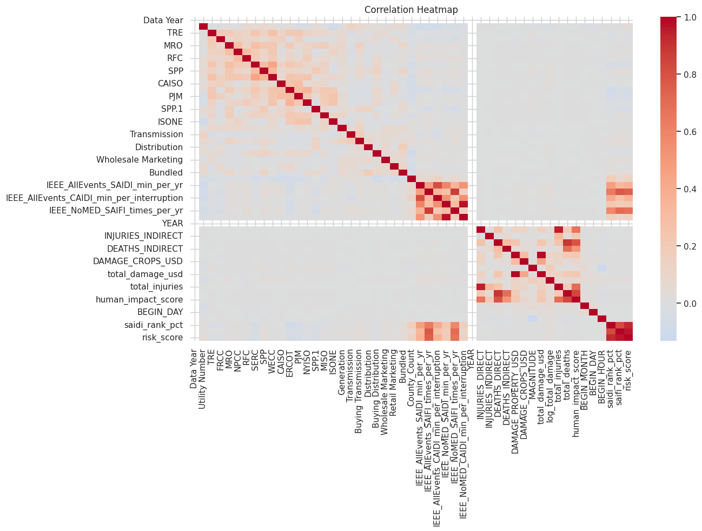
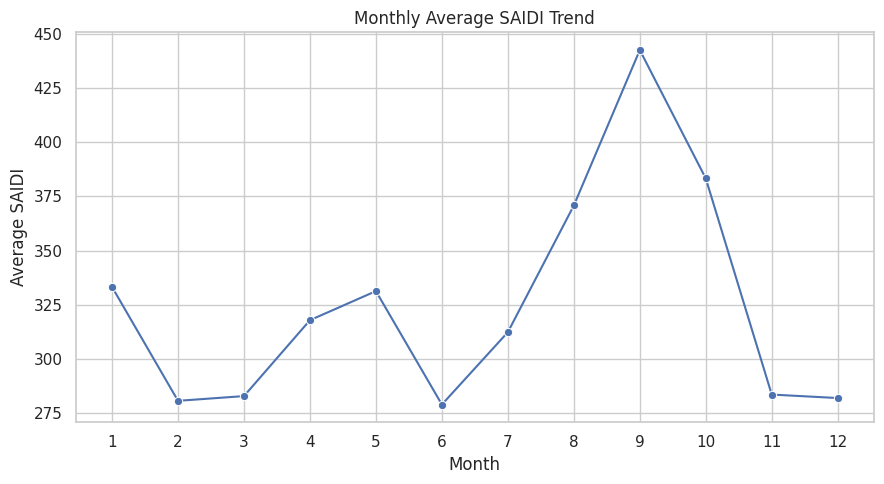
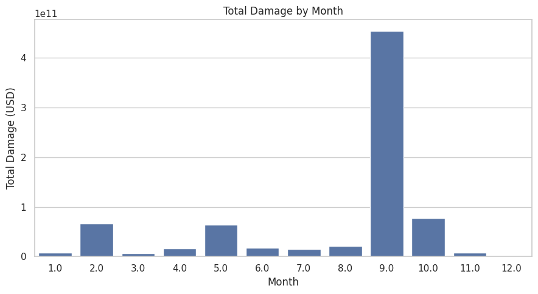
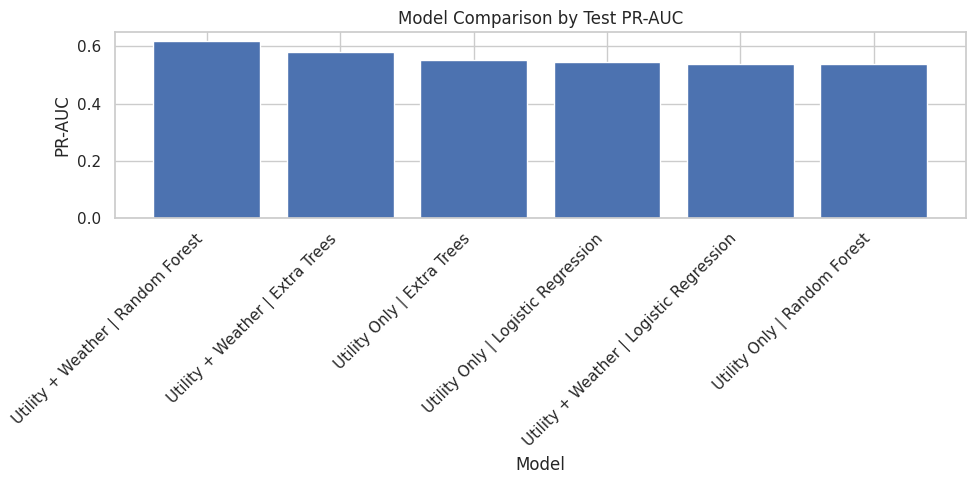
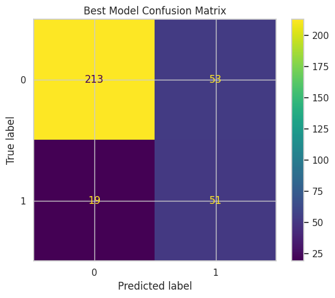
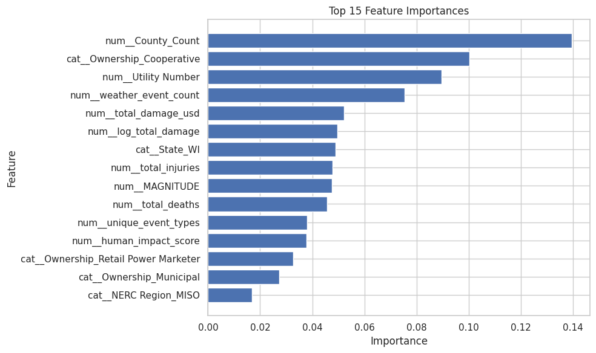
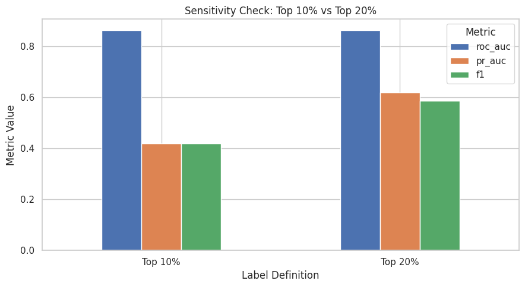

# ⚡ Power Outage Risk Analysis

This project looks at outage risk across U.S. utilities by combining **EIA-861 reliability data** with **NOAA storm event records**.

I wanted this analysis to go beyond a basic weather summary. The goal was to see where outage performance looks weak even after considering storm exposure, then turn that into a clean dataset and a dashboard-friendly workflow.

---

## ✨ What’s inside

- utility + storm data combined at scale
- a cleaned dashboard dataset built from **3.44M merged records**
- final analysis dataset with **1,910,188 rows** and **58 columns**
- coverage across the **50 U.S. states**
- outage risk scoring using **SAIDI** and **SAIFI**
- state-level comparisons and utility-level risk categories
- a modeling section to test whether high-risk utilities can be identified from utility and weather features

---

## 🧩 Data used

- **EIA-861** utility reliability data  
- **NOAA Storm Events** data  

**Dataset link**  
[merged_utility_storm_2024.csv](https://drive.google.com/file/d/1ppvx0fkmi1QdsbZOnhZ-LAEc-BPF52DS/view?usp=drive_link)

---

## 🎯 Project goal

The main question behind this project was simple:

**Which utilities and states look more outage-prone than weather exposure alone would explain?**

To answer that, I built a workflow that:
- cleaned the merged utility-storm dataset
- kept only the fields needed for dashboarding and analysis
- ranked utilities using reliability metrics
- grouped utilities into risk categories
- tested whether adding weather features improves high-risk utility prediction

---

## 🛠️ Tools used

`Python` `Pandas` `NumPy` `Matplotlib` `Seaborn` `Scikit-learn` `Jupyter Notebook`

---

## 📊 What I built

### 1) Clean dashboard dataset
The raw merged file was processed in chunks, filtered to the **50 states**, cleaned, de-duplicated, and saved as:

- `dashboard_clean_dataset.csv`
- `dashboard_clean_dataset.parquet`

### 2) Reliability and storm analysis
I explored patterns in:
- **SAIDI**
- **SAIFI**
- **CAIDI**
- storm event types
- damage by month
- state-level record concentration
- outage metric distributions

### 3) Risk categorization
Utilities were scored using percentile-based outage measures and assigned into **Low / Medium / High Risk** groups.

### 4) Utility-level modeling
I aggregated the data to a utility-level dataset with **1,677 utilities** and labeled the top **20.93%** as high risk.

Then I compared:
- **Utility Only** models
- **Utility + Weather** models

The best result came from **Random Forest with utility + weather features**.

---

## 🔍 A few project results

- final cleaned dataset: **1,910,188 rows × 58 columns**
- utility-level modeling dataset: **1,677 utilities**
- high-risk utilities: **351**
- best model: **Random Forest (Utility + Weather)**
- best test **PR-AUC:** **0.6185**
- best test **ROC-AUC:** **0.8623**
- improvement from adding weather features: **+0.0648 PR-AUC**

The sensitivity check also showed:
- **Top 10%** threshold → PR-AUC **0.4184**
- **Top 20%** threshold → PR-AUC **0.6185**

---

## 📈 Dashboard visuals And Outputs saved in this repo

All saved notebook visuals are included in `dashboards/screenshots/`.


### Dashboard visuals


### Preview

#### Risk category distribution


#### SAIDI vs SAIFI


#### Top event types


#### Monthly average SAIDI trend


#### Model comparison


#### Best model confusion matrix


#### Top feature importances


#### Sensitivity check


See the full visual list here: [dashboards/VISUALS.md](dashboards/VISUALS.md)

---

## 📁 Repository structure

```text
power-outage-risk-analysis/
├── README.md
├── data/
│   ├── raw/
│   └── processed/
├── notebooks/
│   └── Power Outage Risk Analysis.ipynb
├── dashboards/
│   ├── screenshots/
│   └── VISUALS.md
├── outputs/
└── src/
```

---

## 📌 Saved visuals

The notebook outputs saved in this repo include:

- Top Missing Values
- Risk Category Distribution
- Correlation Heatmap
- Distribution of SAIDI
- Distribution of SAIFI
- Distribution of CAIDI
- SAIDI by Risk Category
- SAIFI by Risk Category
- Top 15 States by Record Count
- Top 15 Event Types
- Monthly Average SAIDI Trend
- Total Damage by Month
- SAIDI vs SAIFI
- Class Balance: Low Risk vs High Risk
- Model Comparison by Test PR-AUC
- Utility Only vs Utility + Weather (PR-AUC)
- Best Model Confusion Matrix
- Best Model ROC Curve
- Best Model Precision-Recall Curve
- Prediction Error Type Distribution
- Top 15 Feature Importances
- Top 15 States by Actual High-Risk Utilities
- Predicted Probability by Error Type
- Sensitivity Check: Top 10% vs Top 20%
- High-Risk Class Percentage by Label Definition
- Composite Risk Threshold by Label Definition

---

## 🚀 Why this project matters

What I like about this project is that it combines:
- large-scale data cleaning
- reliability metric design
- dashboard preparation
- business-style analysis
- and a practical modeling extension

It works well as both an analytics project and a portfolio piece because it shows the full flow from raw data to decision-ready output.

---

## 👩‍💻 Author

**Sejal Khade**  
Data Analyst | SQL | Python | Power BI | Tableau
